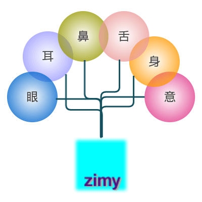

# 自说自话

没错，自我感觉相当 OuterMan，既out还慢
总是用不着急、不要脸自勉
别人用博客记录成长而我要记录的是如何老去...  ​:cry:​ 主要是怕忘记密码

{: .align-right}

特别是生命的密码

眼、耳、鼻、舌、身、意，叫做六根，所对应的色、声、香、味、触、法，叫做六尘，六根对六尘而生出六识。

很多事了解的太晚，比如老不看三国少不看水浒，错过时间的安排就会成为一个怪物：Automan会变成Outerman。

==Z说== ——  遇见的杂七杂八              六根

==Z话==  ——  希望记下的意识              六识

==Z参==  ——  混饭用到的资料档          故纸堆

==Z考==  ——  混饭的境界                      说教

==Z轴==  ——  技术路径时间轴              轴

**Zgene**  应该就是这些东西凑一块，形成的具备Z基因特征的怪物。
