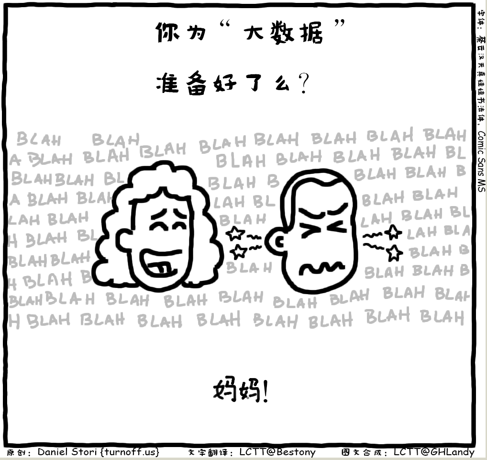

​     今天母亲节，想起前不久看到的大数据漫画。只需要将下面的文字改成妈妈，母爱一样是大数据。很伟大！​:bouquet:​

---

  原图来自[极客漫画](https://linux.cn/article-8475-1.html) （原作者：[Daniel Stori](http://turnoff.us/about/) 翻译合成：[GHLandy](https://github.com/GHLandy) 校对：[wxy](https://github.com/wxy)  [Linux中国首发](https://linux.cn/article-8485-1.html)），是一个关注IT的漫画系列。不仅画些IT的喜怒哀乐，重要的是将一些复杂的信息技术概念画的一目了然、生动有趣，比如这篇：[Linux 内核到底长啥样](https://linux.cn/article-8290-1.html) ,很赞。

  另外，里面《消沉的程序员系列》也不错，其中一张漫画讲的信息安全，一周后勒索病毒席卷全球很应景。

>译者[GHLandy](http://ghlandy.com/)   ——  生活中所有欢乐与苦闷都应藏在心中，有些事儿注定无人知晓，自己也无从说起。 
>
> 林彪 ——   话要少说，书要多读。不明白的事情，不应该说；真正明白了，就没有必要说了。所以，能说的话大都是无聊的重复... 
